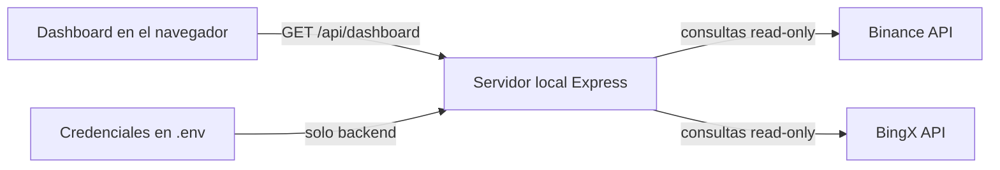

# Satoshi Ledger

Un dashboard local y **read-only** para consultar, en un solo lugar, posiciones y actividad de [Binance](https://www.binance.com/) y [BingX](https://bingx.com/).

Está pensado como una vista personal de portfolio: muestra balances Spot, costo promedio, posiciones abiertas, PnL y el historial de futuros sin enviar órdenes ni exponer las API keys al navegador.

> Proyecto personal en desarrollo. No es asesoramiento financiero ni reemplaza los datos oficiales del exchange.

## Qué incluye

| Sección | Información |
| --- | --- |
| **Dashboard** | BTC Spot, costo promedio, equity estimado y posiciones abiertas. |
| **Open Positions** | Binance USD-M/COIN-M y BingX Perpetual, con PnL individual y total. |
| **Spot History** | Holdings Spot, precio promedio de compra e historial disponible. |
| **Trading History** | Cierres de futuros, ganancias, pérdidas, fees y resultado neto. |
| **Actualización automática** | Snapshot inicial y refresco cada minuto mientras la pestaña está visible. |

Las posiciones con PnL positivo se destacan progresivamente a partir de **10%**, **15%** y **20%** para facilitar el seguimiento visual.

## Cómo funciona



- El servidor escucha únicamente en `127.0.0.1`.
- Las credenciales se leen desde `.env` en el backend.
- El navegador recibe datos normalizados, nunca las API keys o secrets.
- No hay base de datos ni almacenamiento remoto propio.
- El botón **Update** permite actualizar manualmente en cualquier momento.

## Requisitos

- Node.js 20 o superior.
- API keys de Binance y/o BingX con permisos exclusivamente de lectura.

## Instalación

```bash
git clone https://github.com/danteallievi/cashflow-dashboard.git
cd cashflow-dashboard
npm install
cp .env.example .env
```

Completá en `.env` solamente los exchanges que quieras consultar:

```dotenv
PORT=3000

BINANCE_API_KEY=
BINANCE_API_SECRET=

BINGX_API_KEY=
BINGX_API_SECRET=
```

Después iniciá la aplicación:

```bash
npm start
```

Abrí [http://localhost:3000](http://localhost:3000).

## Seguridad

Este proyecto está diseñado para ejecutarse localmente, pero la seguridad final también depende de cómo configures tus cuentas:

1. Creá keys nuevas para este dashboard.
2. Habilitá únicamente permisos de lectura.
3. **Nunca habilites trading ni retiros.**
4. Si el exchange lo permite, restringí las keys por IP.
5. No compartas, subas ni copies tu archivo `.env`.
6. Si una key alguna vez aparece en Git, revocala; borrarla de un commit posterior no es suficiente.

`.env` y `node_modules/` están excluidos mediante `.gitignore`. El archivo `.env.example` contiene solamente nombres de variables y puede mantenerse público.

## Cómo se calcula el PnL abierto total

Para poder combinar mercados distintos se usa USD como unidad común:

- **USD-M y Perpetual:** el PnL informado en USD/USDT se suma directamente.
- **COIN-M:** el PnL nativo en BTC se convierte a USD usando el mark price disponible.
- También se muestra un equivalente total en BTC usando el precio de referencia actual.

El resultado es una estimación al mark price y puede diferir del cierre efectivo por fees, funding, slippage o cambios de precio.

## Tests

```bash
npm test
```

## Estructura

```text
public/          interfaz del dashboard
src/exchanges/   clientes read-only de Binance y BingX
src/services/    normalización y cálculos de portfolio/PnL
src/utils/       HTTP, firmas, números y errores seguros
test/            tests con Node Test Runner
```

## Privacidad

Los datos se consultan directamente desde este servidor local hacia los exchanges configurados. No se incluyen analytics, trackers ni servicios externos propios. Revisá siempre el código y los permisos de tus keys antes de ejecutar una herramienta financiera.

